# AWS Modernization Mini Projects (LocalStack Deployments)

This repository contains five short AWS modernization mini-projects, each built and deployed locally using [LocalStack](https://www.localstack.cloud/).  
These exercises demonstrate key AWS concepts in a hybrid-cloud modernization context,from serverless automation to container orchestration.

All screenshots below are from my LocalStack deployments, showing real outputs, CLI interactions, and Docker activity.
- 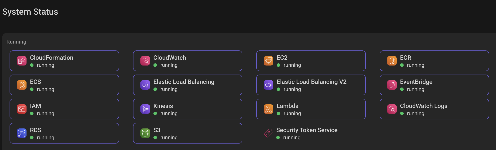
---

## Serverless File Uploader (S3 + Lambda)
Simulates a serverless workflow where a Lambda function uploads files to an S3 bucket.  
This project demonstrates event-driven compute and object storage integration.

**LocalStack Deployment Screenshots**
- 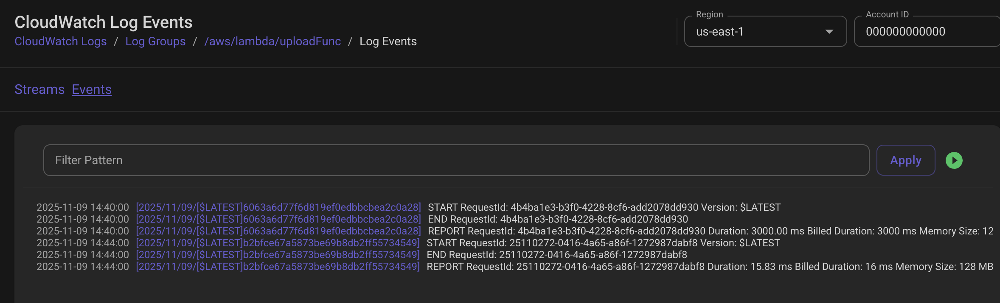
- 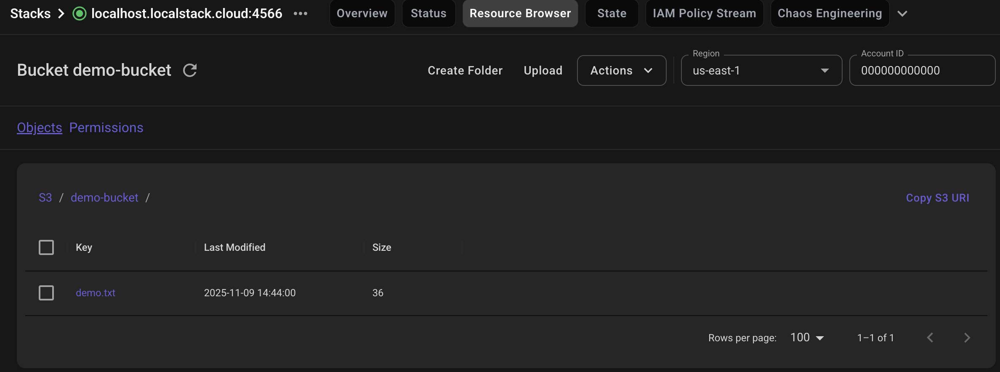

---

## Lift-and-Shift Simulation (EC2 + RDS + IAM)
Models an on-prem migration to AWS by provisioning IAM roles, an EC2 app tier, and an RDS database tier in LocalStack.  
Focuses on IAM, tagging, and relational database deployment.

**LocalStack Deployment Screenshots**
- 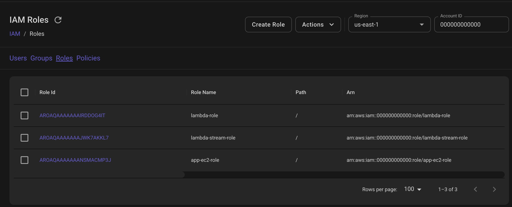
- 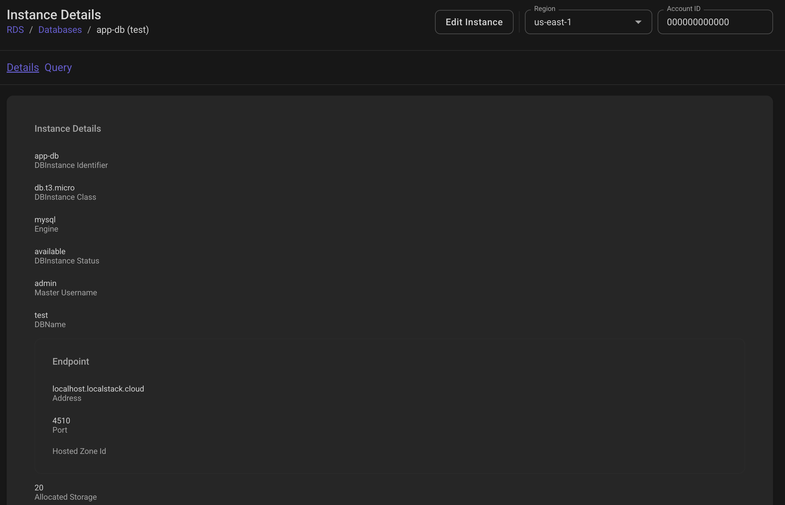

---

## Infrastructure as Code (CloudFormation)
Uses a CloudFormation template to automatically deploy a Lambda function and S3 bucket.  
Highlights Infrastructure as Code and CloudFormation’s orchestration capabilities.

**LocalStack Deployment Screenshots**
- 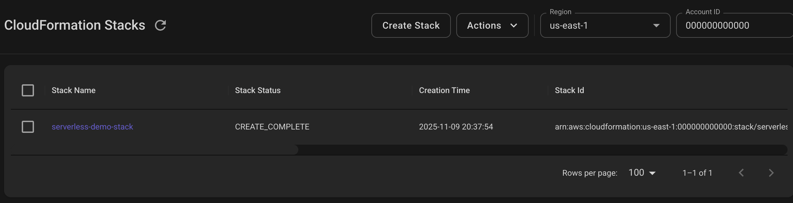
- 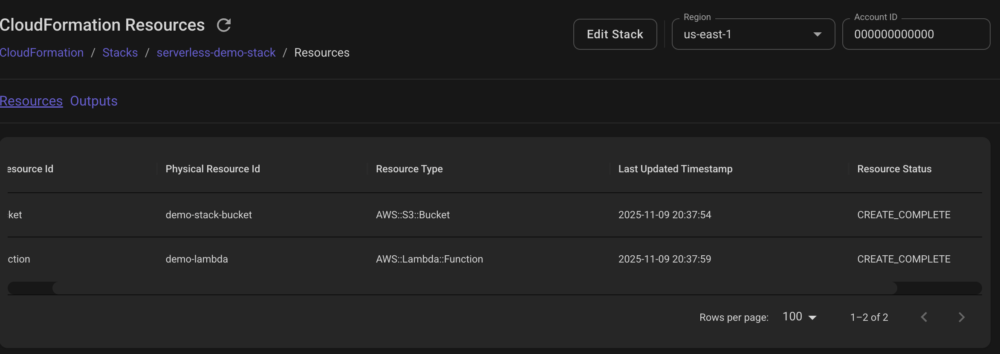

---

## Data Pipeline Simulation (Kinesis + Lambda + S3)
Demonstrates real-time data ingestion with Kinesis streams triggering Lambda to write data to S3.  
Emulates an event-driven data pipeline fully inside LocalStack.

**LocalStack Deployment Screenshots**
- 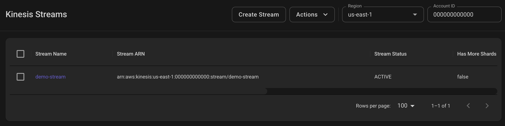
- 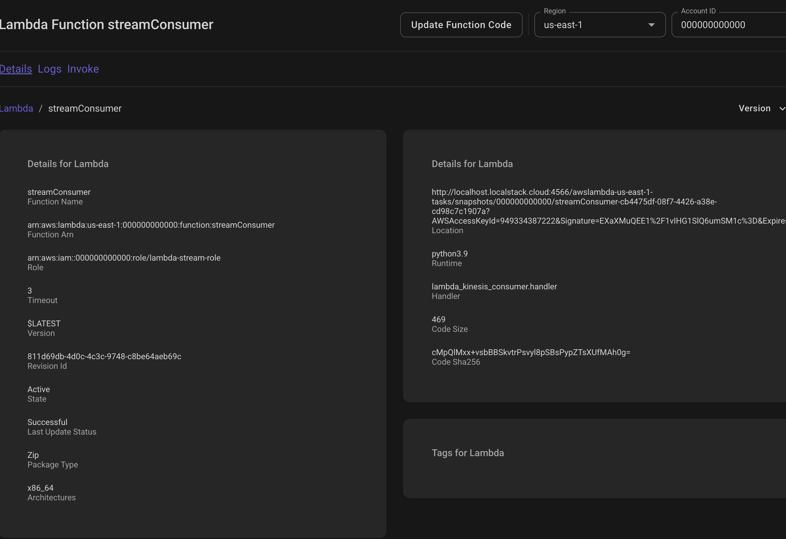
- 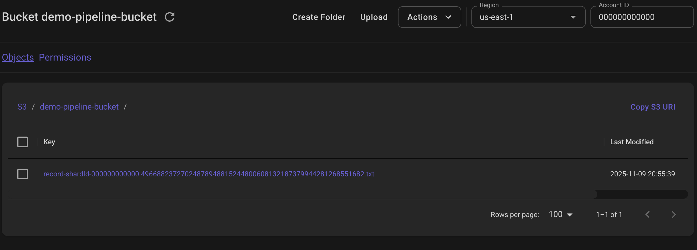

---

## Containerized Microservice (ECR + ECS)
Containerizes a Flask app and deploys it as a microservice to a mock ECS cluster.  
Replicates a modernized container workflow: build → tag → push → orchestrate.

**LocalStack Deployment Screenshots**
- 
- 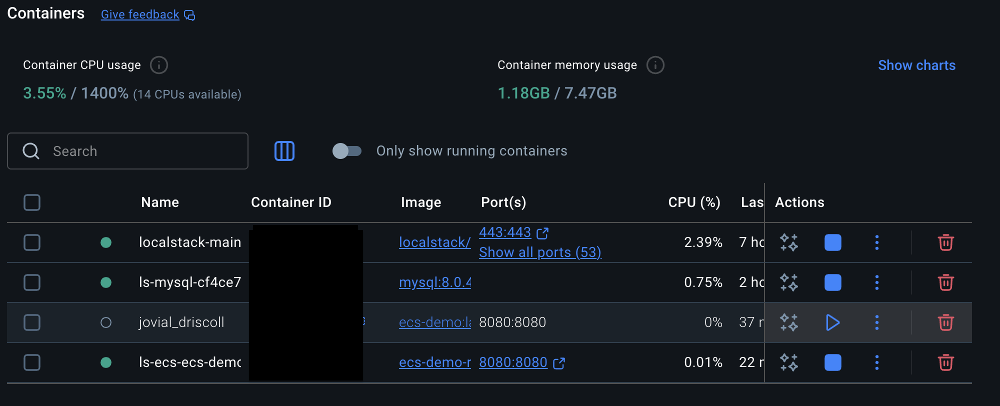
- 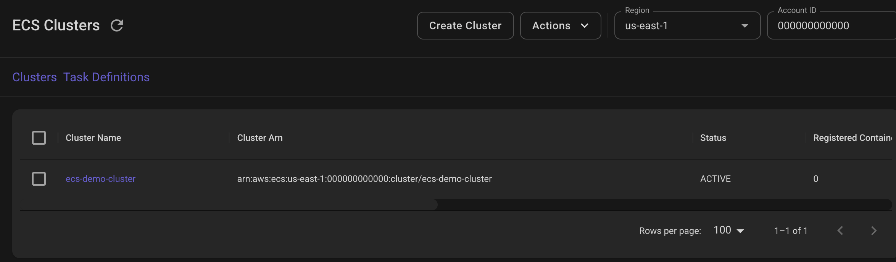

---

## Notes
- All deployments were completed locally through **LocalStack** running in Docker.  
- CLI commands and YAML/JSON definitions for each project are available in their respective subfolders.  
- These screenshots serve as a visual proof of successful AWS service emulation and end-to-end deployment testing.
